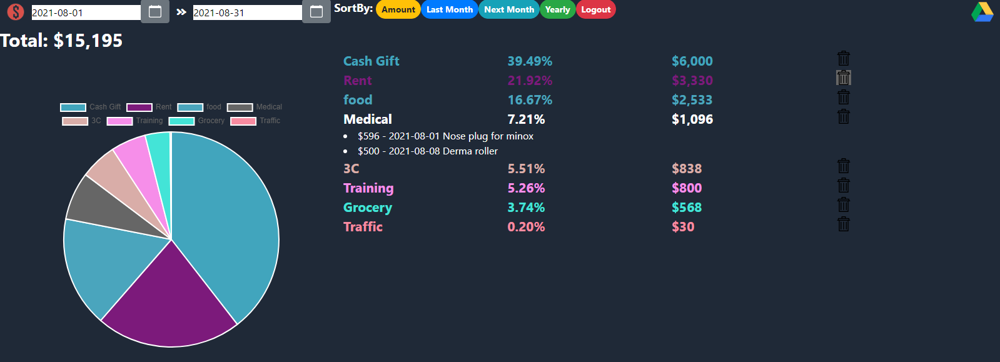

# Ahorro.js

<!-- TABLE OF CONTENTS -->

  
Table of Contents

  <ol>
    <li>
      <a href="#about-the-project">About The Project</a>
      <ul>
        <li><a href="#built-with">Built With</a></li>
      </ul>
    </li>
    <li>
      <a href="#getting-started">Getting Started</a>
      <ul>
        <li><a href="#prerequisites">Prerequisites</a></li>
        <li><a href="#installation">Installation</a></li>
      </ul>
    </li>
    <li><a href="#usage">Usage</a></li>
    <li><a href="#license">License</a></li>
    <li><a href="#contact">Contact</a></li>
  </ol>

<!-- ABOUT THE PROJECT -->
## About The Project

* Fetch the backup file from your phone and insert into MongoDB.
* Show the customized report and entries summary based on MKVN and GraphQL.
* Makes bookkeeping report clean and useful.

### Built With

* [ExpressJS](https://expressjs.com/)
* [TailwindCSS](https://tailwindcss.com/)
* [Vue](https://vuejs.org/)
* [MongoDB](https://www.mongodb.com/)

<!-- LICENSE -->
## License

Distributed under the MIT License. See `LICENSE` for more information.
